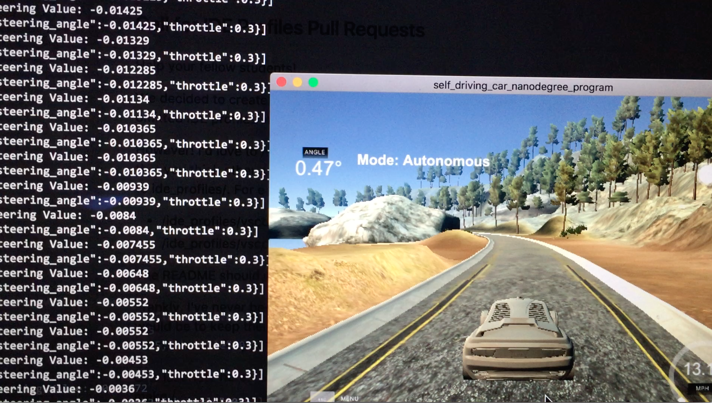
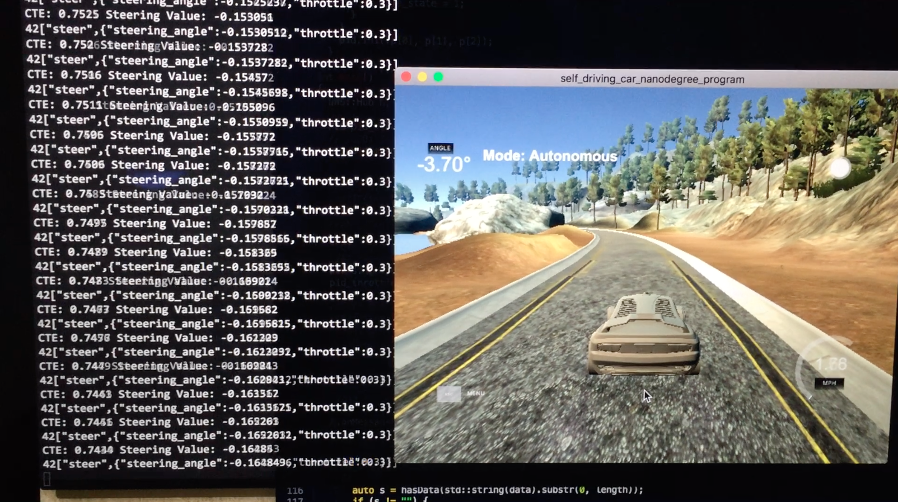

# CarND-Controls-PID
Self-Driving Car Engineer Nanodegree Program
---
### Describes the effect of the P, I, D component of the PID algorithm in their implementation


- The P (proportional) term is the primary to control the cross-track error (CTE) which is weight by a constant value Kp, proportional determine the speed of the control system response, as one increases the proportional gain, the system becomes faster, but care must be taken not make the system unstable. Once P has been set to obtain a desired fast response, the integral term is increased to stop the oscillations. So, if the Kp is too small, it's hard to minimize the error (here consider using P and I terms), unable to response to changes of our system. On the other hand, if Kp is too large, the system will have unstable behavior and overshoot the desired value.

- The I (Integral) term is the controller handle error sum of the cross-track error over the time. it reduces the steady state error, but increases overshoot. Some amount of overshoot is always necessary for a fast system so that it could respond to changes immediately. The integral term is tweaked to achieve a minimal steady state error. The Integral term is weight by a constant Ki, if you have a large Ki, you're trying to correct error over time so it can interfere with your response for dealing with current changes.

- The D (Derivative) term is looking at how the system is behaving between timer intervals, which is weight by a constant value Kd. Once the P and I have been set to get the desired fast control system with minimal steady state error, the derivative term is increased until the loop is acceptably quick to its set point. Increasing derivative term decreases overshoot and yields higher gain with stability but would cause the system to be highly sensitive to noise.

---
### how chose the final hyperparameters (P, I, D coefficients).

Firstly, I set the controller Integral term's value Ki and Derivative term's value Kd to zero, because the fewer terms is more easier to understand and implement. I tried to set the value of Kp in my filter to find the better value, I referenced the lesson of PID Control, set Kp value to 0.2, and then tried to set value 0.15, the value 0.15 is better than 0.2, but all of them have a very unstable result, it leave out of the desired trajectory. After that, I tried to add the weight Kd to make the car behavior more stable between the time intervals, it evident that it decrease the oscillate, and the way of leaves out of the trajectory is longer than before. 

After several times, I consider to tradeoff one characteristic of a control system for another to better meet their requirements.

The final weights I chose in my PID controller: Kp = 0.13, Ki = 0.0003, Kd = 3.01.

I used the "Twiddle" algorithm to tune the coefficient for the P, I and D components of the controller. The twiddle algorithm is continually adjust the PID coefficients when the car drives, to find the lowest(close to 0) overall error.

Below are the two videos I recorded about chose hyperparameters:
[](https://youtu.be/lrWuNwt9yWQ)
[](https://youtu.be/8c9tRUAYwlg)

---

## Dependencies

* cmake >= 3.5
 * All OSes: [click here for installation instructions](https://cmake.org/install/)
* make >= 4.1
  * Linux: make is installed by default on most Linux distros
  * Mac: [install Xcode command line tools to get make](https://developer.apple.com/xcode/features/)
  * Windows: [Click here for installation instructions](http://gnuwin32.sourceforge.net/packages/make.htm)
* gcc/g++ >= 5.4
  * Linux: gcc / g++ is installed by default on most Linux distros
  * Mac: same deal as make - [install Xcode command line tools]((https://developer.apple.com/xcode/features/)
  * Windows: recommend using [MinGW](http://www.mingw.org/)
* [uWebSockets](https://github.com/uWebSockets/uWebSockets)
  * Run either `./install-mac.sh` or `./install-ubuntu.sh`.
  * If you install from source, checkout to commit `e94b6e1`, i.e.
    ```
    git clone https://github.com/uWebSockets/uWebSockets 
    cd uWebSockets
    git checkout e94b6e1
    ```
    Some function signatures have changed in v0.14.x. See [this PR](https://github.com/udacity/CarND-MPC-Project/pull/3) for more details.
* Simulator. You can download these from the [project intro page](https://github.com/udacity/self-driving-car-sim/releases) in the classroom.

There's an experimental patch for windows in this [PR](https://github.com/udacity/CarND-PID-Control-Project/pull/3)

## Basic Build Instructions

1. Clone this repo.
2. Make a build directory: `mkdir build && cd build`
3. Compile: `cmake .. && make`
4. Run it: `./pid`. 

## Editor Settings

We've purposefully kept editor configuration files out of this repo in order to
keep it as simple and environment agnostic as possible. However, we recommend
using the following settings:

* indent using spaces
* set tab width to 2 spaces (keeps the matrices in source code aligned)

## Code Style

Please (do your best to) stick to [Google's C++ style guide](https://google.github.io/styleguide/cppguide.html).

## Project Instructions and Rubric

Note: regardless of the changes you make, your project must be buildable using
cmake and make!

More information is only accessible by people who are already enrolled in Term 2
of CarND. If you are enrolled, see [the project page](https://classroom.udacity.com/nanodegrees/nd013/parts/40f38239-66b6-46ec-ae68-03afd8a601c8/modules/f1820894-8322-4bb3-81aa-b26b3c6dcbaf/lessons/e8235395-22dd-4b87-88e0-d108c5e5bbf4/concepts/6a4d8d42-6a04-4aa6-b284-1697c0fd6562)
for instructions and the project rubric.

## Hints!

* You don't have to follow this directory structure, but if you do, your work
  will span all of the .cpp files here. Keep an eye out for TODOs.

## Call for IDE Profiles Pull Requests

Help your fellow students!

We decided to create Makefiles with cmake to keep this project as platform
agnostic as possible. Similarly, we omitted IDE profiles in order to we ensure
that students don't feel pressured to use one IDE or another.

However! I'd love to help people get up and running with their IDEs of choice.
If you've created a profile for an IDE that you think other students would
appreciate, we'd love to have you add the requisite profile files and
instructions to ide_profiles/. For example if you wanted to add a VS Code
profile, you'd add:

* /ide_profiles/vscode/.vscode
* /ide_profiles/vscode/README.md

The README should explain what the profile does, how to take advantage of it,
and how to install it.

Frankly, I've never been involved in a project with multiple IDE profiles
before. I believe the best way to handle this would be to keep them out of the
repo root to avoid clutter. My expectation is that most profiles will include
instructions to copy files to a new location to get picked up by the IDE, but
that's just a guess.

One last note here: regardless of the IDE used, every submitted project must
still be compilable with cmake and make./

## How to write a README
A well written README file can enhance your project and portfolio.  Develop your abilities to create professional README files by completing [this free course](https://www.udacity.com/course/writing-readmes--ud777).

